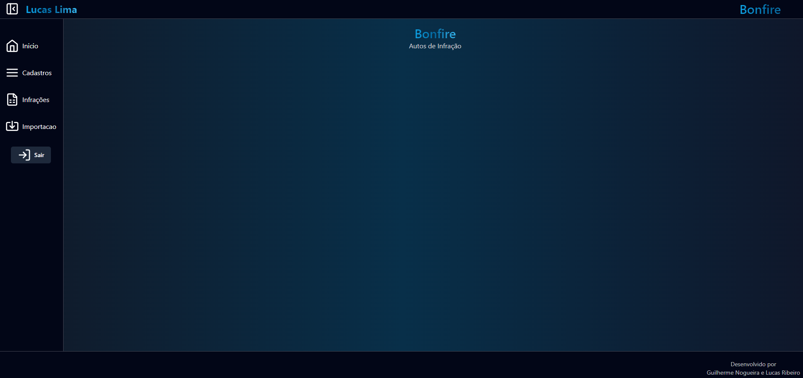
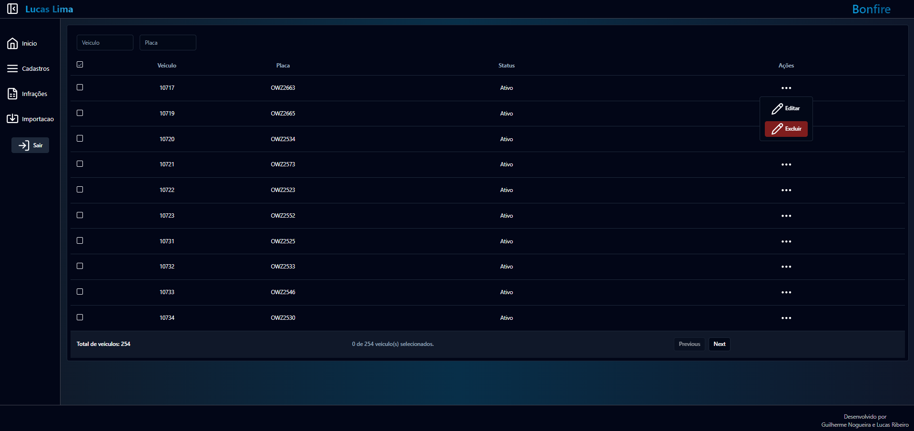
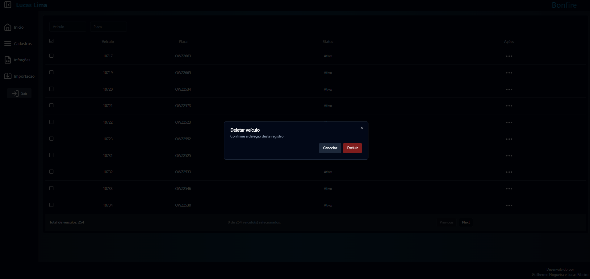
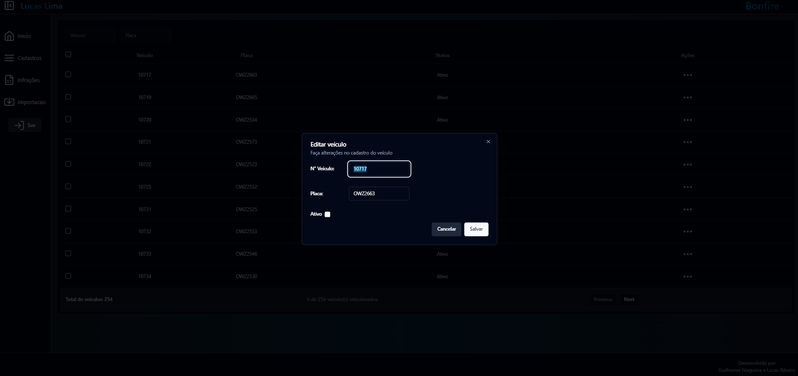
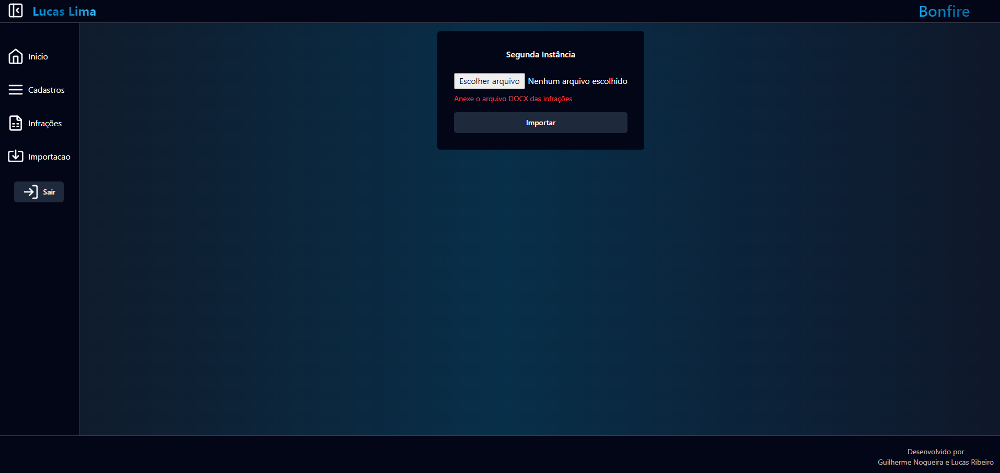
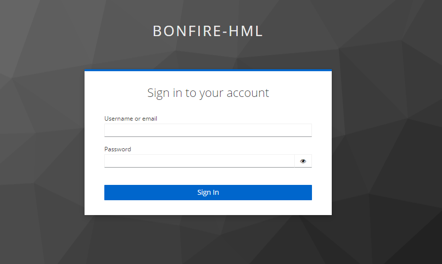

# **Bonfire: Projeto em Next.Js**

Apresento o Bonfire, um projeto de frontend desenvolvido exclusivamente por mim, Lucas Ribeiro Lima. Este aplicativo, construído em Next.js, reflete meu comprometimento com o desenvolvimento de software eficiente e aprimorado. Aqui estão as principais tecnologias e habilidades demonstradas:

- **Next.js** 🔗: Estrutura React poderosa para uma experiência de usuário rápida e eficiente.
- **Tailwind CSS** 🎨: Framework CSS utilitário para estilos modernos e responsivos.
- **Axios** 🌐: Cliente HTTP para comunicação eficaz com a API.
- **SWR (Stale-While-Revalidate)** 🔄: Gerenciamento inteligente de estado para otimização de desempenho.
- **Shadcn/UI** 🚀: Componentes prontos para uso, acelerando o desenvolvimento.
- **Tanstack React Tables** 📉: Biblioteca para manipulação de tabelas React.
- **React Hook Form** 📝: Manipulação e validação eficientes de formulários.
- **Lucide React** ✨: Ícones elegantes para aprimorar a experiência visual.
- **Zod** 🛡️: Garantia de validação de dados para integridade do projeto.
- **NextAuth** 🅰️: Autenticação de terceiros e OAuth.

# **Variaveis de Ambiente**

- NEXT_PUBLIC_API_URL=http://localhost
- NEXT_PUBLIC_API_PORT=5000
- NEXTAUTH_SECRET=SECRET
- NEXTAUTH_URL=http://localhost:3000
- BONFIRE_ID=keycloak-client-id
- BONFIRE_CLIENT_SECRET=keycloak-client-secret
- KEYCLOAK_ISSUER=http://keycloak-host/realms/keycloak-realm

# **🎨 Illustration**

### Home Page

### Tables

### Import

### Next-auth Keycloak

Agradeço a todos que contribuíram, especialmente a você, por explorar o Bonfire e testemunhar meu compromisso com a excelência no desenvolvimento de software. 🔥✨
